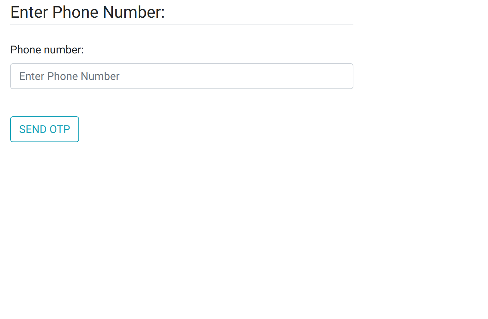

# Subscription Service System

> This web application is a simple subscription by phone number system.
 
### Setting up the virtual environment and dependencies: 
1. hit `python3 -m venv env` to create a virtual environment
2. hit `source env/bin/activate` to activate the virtual environment
3. while the environment is activated, hit `pip install -r requirements.txt` to install dependencies
4. hit `pip list` to verify the dependencies have been installed
5. install MySQL and run the MySQL server following this guide: (https://www.digitalocean.com/community/tutorials/how-to-install-mysql-on-ubuntu-20-04)
6. inside MySQL, create an empty db called `subscribtion_service` 
7. hit `python3 manage.py migrate` to apply the migrations (MySQL server must be running)
8. hit `python3 manage.py createsuperuser` to create the superuser

### Running the application:
1. make sure you are inside the project's top level directory, and app_env is activated
2. make sure the MySQL server is running, otherwise a new database will be created each time you run the server
3. check for uncreated or unapplied migrations: `python3 manage.py makemigrations && python3 manage.py migrate`
4. hit `python3 manage.py runserver` and access the application at the given port

## Enter Phone Number Page

Visit the home page link

In order to get an OTP, you have to insert a valid phone number and then press the SEND OTP button.

Incase of entering an invalid phone number you will get an error

## Verify OTP Page

In order to verify an OTP, you have to insert a the OTP sent on your number and then press the Verify OTP button.

Incase of entering a wrong OTP you will get an error, press the Resend OTP button to get the OTP again.

## Subscribed Page

When you enter the correct OTP succesfully, you will see the subscribed page.

